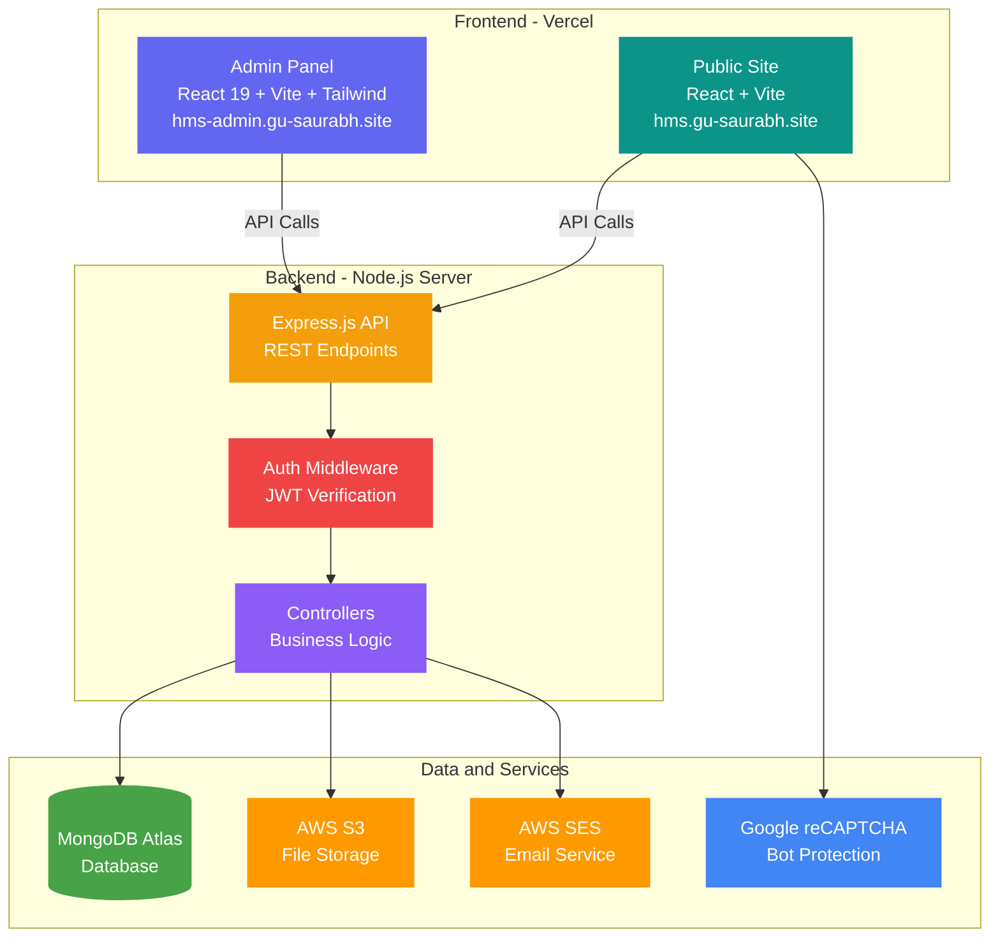
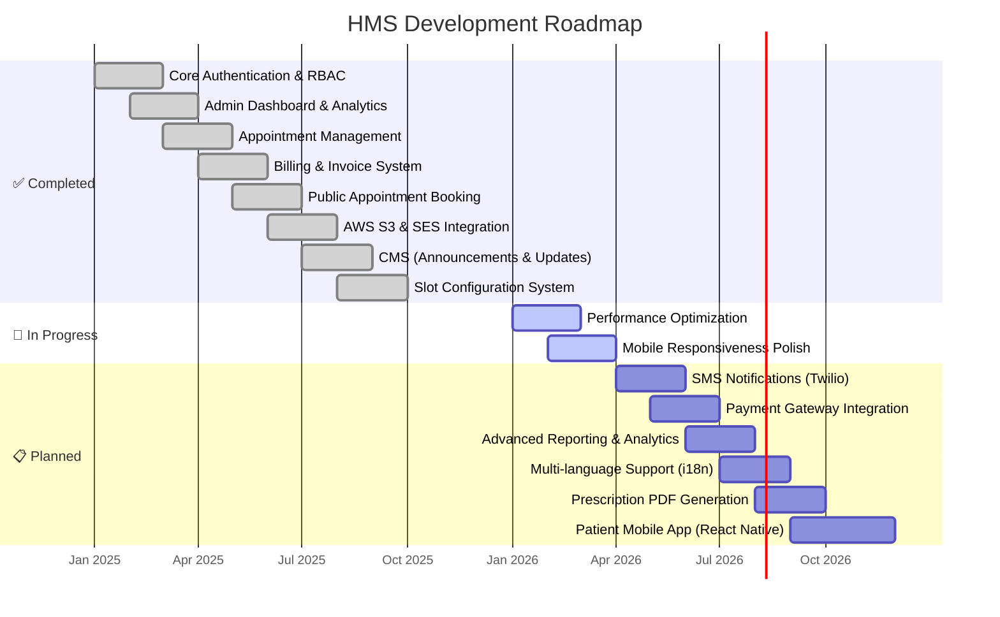

<div align="center">

<!-- Animated Header Banner -->


<br/>

<!-- Badges Row 1 -->
[](https://github.com/Saurabhtbj1201/Hospital-Management-System/stargazers)
[](https://github.com/Saurabhtbj1201/Hospital-Management-System/network/members)
[](https://github.com/Saurabhtbj1201/Hospital-Management-System/issues)
[](https://github.com/Saurabhtbj1201/Hospital-Management-System/pulls)
[](#-license)

<!-- Badges Row 2 -->
[](#)
[](#)
[](#)
[](#)
[](#)
[](#)
[](#)
[](#)

<br/>

### 🌐 Live Demo

<table>
<tr>
<td align="center">
<a href="https://hms.gu-saurabh.site/">

</a>
<br/><sub><b>Patient Appointment Booking</b></sub>
</td>
<td align="center">
<a href="https://hms-admin.gu-saurabh.site/">

</a>
<br/><sub><b>Staff & Management Portal</b></sub>
</td>
<td align="center">
<a href="https://projects.gu-saurabh.site/opensource/contribute-hospital-management-system-hms">

</a>
<br/><sub><b>Full Project Details & Contribution</b></sub>
</td>
</tr>
</table>

<br/>

> 💬 **Feedback is warmly welcomed!** Found a bug? Have a feature idea? [Open an issue](https://github.com/Saurabhtbj1201/Hospital-Management-System/issues/new) or reach out directly.

</div>

---

## 📋 Table of Contents

<details>
<summary>Click to expand</summary>

- [✨ Overview](#-overview)
- [🎯 Key Features](#-key-features)
- [🏗️ Architecture Diagram](#️-architecture-diagram)
- [👥 User Role Access Matrix](#-user-role-access-matrix)
- [🛠️ Tech Stack](#️-tech-stack)
- [📁 Project Structure](#-project-structure)
- [🚀 Getting Started](#-getting-started)
- [⚙️ Environment Variables](#️-environment-variables)
- [🔑 Test Credentials](#-test-credentials)
- [📡 API Endpoints](#-api-endpoints)
- [🔒 Security Features](#-security-features)
- [🛣️ Roadmap](#️-roadmap)
- [🤝 Contributing](#-contributing)
- [🐛 Reporting Issues](#-reporting-issues)
- [📜 Pull Request Rules](#-pull-request-rules)
- [⭐ Show Your Support](#-show-your-support)
- [📄 License](#-license)
- [👨‍💻 Developer](#-developer)

</details>

---

## ✨ Overview

**Hospital Management System (HMS)** is a comprehensive, full-stack, open-source healthcare management platform designed to streamline hospital operations. It features **role-based access control** with dedicated portals for **Admins**, **Receptionists**, and **Doctors**, along with a **public-facing site** for patients to book appointments online.

<div align="center">

```
🏥 One Platform — Three Powerful Portals — Infinite Possibilities
```

| 🌐 Public Site | 🔐 Admin Portal | 👩‍⚕️ Receptionist Portal | 🩺 Doctor Portal |
|:-:|:-:|:-:|:-:|
| Appointment Booking | Full System Control | Operations & Billing | Clinical Management |
| Department Browsing | User & Role Management | Patient Records | Appointment Handling |
| Doctor Discovery | Analytics Dashboard | Invoice Generation | Profile & Availability |

</div>

---

## 🎯 Key Features

<table>
<tr>
<td width="50%">

### 🔐 Authentication & Security
- ✅ Login via **Email** or **Phone Number**
- ✅ **JWT Token**-based authentication
- ✅ **Role-Based Access Control** (RBAC)
- ✅ **bcrypt** password hashing (salt rounds: 10)
- ✅ Protected routes with automatic role redirection
- ✅ **Helmet.js** HTTP security headers
- ✅ **Google reCAPTCHA** integration (Public site)

</td>
<td width="50%">

### 👑 Admin Portal
- ✅ **Dashboard** with real-time analytics & charts
- ✅ Admin / Doctor / Receptionist **Management**
- ✅ **Department** & **Service** Management
- ✅ **Appointment** Control & Slot Configuration
- ✅ **Billing** & Custom **Invoice Templates**
- ✅ **Announcements** & **Site Updates** (CMS)
- ✅ **Support Ticket** Management

</td>
</tr>
<tr>
<td width="50%">

### 👩‍⚕️ Receptionist Portal
- ✅ Dashboard with today's appointments & alerts
- ✅ **Create / Confirm / Cancel** Appointments
- ✅ **Patient Management** & Record Updates
- ✅ **Billing & Invoicing** (taxes, discounts)
- ✅ **Slot Management** for doctors
- ✅ Profile Management & Settings

</td>
<td width="50%">

### 🩺 Doctor Portal
- ✅ Dashboard with schedule & pending tasks
- ✅ View **Assigned Appointments**
- ✅ **Patient History** & Records access
- ✅ **Profile Management** & Availability
- ✅ Settings & Preferences
- ✅ Read-only Billing visibility

</td>
</tr>
<tr>
<td colspan="2">

### 🌐 Public Patient Site
- ✅ **Online Appointment Booking** with date & slot selection
- ✅ Browse **Departments** and **Doctors**
- ✅ **Appointment Confirmation** page with details
- ✅ **Google reCAPTCHA** spam protection
- ✅ Responsive & mobile-friendly design

</td>
</tr>
</table>

---

## 🏗️ Architecture Diagram



---

## 👥 User Role Access Matrix

| Feature | 👑 Admin | 👩‍⚕️ Receptionist | 🩺 Doctor | 🌐 Public |
|:---|:---:|:---:|:---:|:---:|
| Dashboard & Analytics | ✅ | ✅ | ✅ | ❌ |
| User Management (CRUD) | ✅ | ❌ | ❌ | ❌ |
| Doctor Management | ✅ | ❌ | ❌ | ❌ |
| Receptionist Management | ✅ | ❌ | ❌ | ❌ |
| Department Management | ✅ | ❌ | ❌ | ❌ |
| Appointment Management | ✅ | ✅ | 👁️ View | ✅ Book |
| Patient Management | ✅ | ✅ | 👁️ View | ❌ |
| Billing & Invoicing | ✅ | ✅ | 👁️ Read-only | ❌ |
| Slot Configuration | ✅ | ✅ | ❌ | ❌ |
| Invoice Template Design | ✅ | ❌ | ❌ | ❌ |
| Announcements (CMS) | ✅ | ❌ | ❌ | ❌ |
| Site Updates (CMS) | ✅ | ❌ | ❌ | ❌ |
| Support Tickets | ✅ | ❌ | ❌ | ❌ |
| Profile Management | ✅ | ✅ | ✅ | ❌ |
| Settings | ✅ | ✅ | ✅ | ❌ |

---

## 🛠️ Tech Stack

<div align="center">

### Frontend
[](https://react.dev/)
[](https://vitejs.dev/)
[](https://tailwindcss.com/)
[](https://reactrouter.com/)
[](https://recharts.org/)

### Backend
[](https://nodejs.org/)
[](https://expressjs.com/)
[](https://www.mongodb.com/)
[](https://mongoosejs.com/)
[](https://jwt.io/)

### Cloud & DevOps
[](https://aws.amazon.com/s3/)
[](https://aws.amazon.com/ses/)
[](https://vercel.com/)

</div>

<details>
<summary>📦 Full Dependency List</summary>

| Package | Version | Purpose |
|:---|:---|:---|
| **Backend** | | |
| `express` | 5.x | Web framework |
| `mongoose` | 9.x | MongoDB ODM |
| `jsonwebtoken` | 9.x | JWT authentication |
| `bcryptjs` | 3.x | Password hashing |
| `helmet` | 8.x | Security headers |
| `cors` | 2.x | Cross-origin support |
| `morgan` | 1.x | HTTP request logging |
| `multer` | 2.x | File upload handling |
| `@aws-sdk/client-s3` | 3.x | AWS S3 integration |
| `@aws-sdk/client-ses` | 3.x | AWS SES email |
| `axios` | 1.x | HTTP client |
| `dotenv` | 17.x | Environment variables |
| **Admin Panel** | | |
| `react` | 19.x | UI framework |
| `react-router-dom` | 7.x | Client-side routing |
| `recharts` | 3.x | Charts & visualization |
| `lucide-react` | 0.56x | Modern icons |
| `react-icons` | 5.x | Additional icons |
| `react-hot-toast` / `sonner` | latest | Toast notifications |
| `react-quill-new` | 3.x | Rich text editor |
| `react-easy-crop` | 5.x | Image cropping |
| `qrcode` | 1.x | QR code generation |
| `@headlessui/react` | 2.x | Accessible UI components |
| `tailwindcss` | 3.x | Utility-first CSS |
| **Client Site** | | |
| `react` | 18.x | UI framework |
| `react-router-dom` | 6.x | Client-side routing |
| `react-google-recaptcha` | 3.x | Bot protection |
| `html2pdf.js` | 0.14 | PDF generation |

</details>

---

## 📁 Project Structure

```
Hospital-Management-System/
│
├── 📂 server/                          # ⚙️ Backend API (Node.js + Express)
│   ├── 📄 package.json
│   ├── 📄 seed.js                      # 🌱 Database seeding script
│   ├── 📄 .env                         # 🔒 Server environment variables
│   └── 📂 src/
│       ├── 📄 app.js                   # Express app configuration
│       ├── 📄 server.js                # Server entry point
│       ├── 📂 config/
│       │   ├── 📄 db.js                # MongoDB connection
│       │   └── 📄 s3.js                # AWS S3 config
│       ├── 📂 controllers/             # 📋 Route handlers
│       │   ├── 📄 authController.js
│       │   ├── 📄 appointmentController.js
│       │   └── ... more controllers
│       ├── 📂 middleware/
│       │   └── 📄 authMiddleware.js    # 🛡️ JWT auth middleware
│       ├── 📂 models/                  # 🍃 Mongoose schemas
│       │   ├── 📄 User.js
│       │   ├── 📄 Admin.js
│       │   ├── 📄 Doctor.js
│       │   └── ... more models
│       ├── 📂 routes/                  # 🛤️ API route definitions
│       │   ├── 📄 authRoutes.js
│       │   ├── 📄 appointmentRoutes.js
│       │   └── ... more routes
│       ├── 📂 services/                # ☁️ External service integrations
│       │   ├── 📄 awsSesService.js     # Email via AWS SES
│       │   ├── 📄 captchaService.js    # reCAPTCHA verification
│       │   └── 📄 s3Service.js         # File upload via AWS S3
│       └── 📂 utils/                   # 🔧 Utility functions
│
├── 📂 Admin/                           # 🔐 Admin Panel (React 19 + Tailwind)
│   ├── 📄 package.json
│   ├── 📄 vite.config.js
│   ├── 📄 tailwind.config.js
│   ├── 📄 vercel.json
│   ├── 📄 .env
│   └── 📂 src/
│       ├── 📄 App.jsx                  # App router & route config
│       ├── 📄 main.jsx                 # Entry point
│       ├── 📂 components/              # 🧩 Reusable components
│       │   ├── 📄 ProtectedRoute.jsx
│       │   └── ... more components
│       ├── 📂 context/
│       │   └── 📄 AuthContext.jsx      # 🔑 Auth state management
│       ├── 📂 layouts/
│       │   └── 📄 AdminLayout.jsx      # 📐 Main layout wrapper
│       ├── 📂 pages/                   # 📄 Page components
│       │   ├── 📄 Login.jsx
│       │   ├── 📄 Dashboard.jsx            # Admin dashboard
│       │   ├── 📄 ReceptionistDashboard.jsx
│       │   └── 📄 *Profile.jsx         # Role-specific profiles
│       │   └── ... more pages
│       ├── 📂 services/
│       │   └── 📄 api.js               # 🌐 Axios API client
│       ├── 📂 styles/
│       │   └── 📄 action-buttons.css
│       └── 📂 utils/
│           └── 📄 helpers.js           # 🔧 Utility functions
│
├── 📂 Client/                          # 🌐 Public Patient Site (React 18)
│   ├── 📄 package.json
│   ├── 📄 vite.config.js
│   ├── 📄 vercel.json
│   ├── 📄 .env
│   └── 📂 src/
│       ├── 📄 App.jsx
│       ├── 📄 main.jsx
│       ├── 📂 pages/
│       │   ├── 📄 Home.jsx             # Landing page
│       │   ├── 📄 AppointmentBooking.jsx
│       │   └── 📄 AppointmentConfirmation.jsx
│       └── 📂 services/
│           └── 📄 api.js               # 🌐 API client
│
├── 📄 README.md                        # 📖 You are here!
└── 📄 .gitignore
```

---

## 🚀 Getting Started

### 📋 Prerequisites

| Requirement | Minimum Version | Recommended |
|:---|:---|:---|
|  | v18+ | v20 LTS |
|  | v6+ | Atlas (Cloud) |
|  | v9+ | Latest |
|  | v2+ | Latest |

### 📥 Installation

**1️⃣ Clone the Repository**

```bash
git clone https://github.com/Saurabhtbj1201/Hospital-Management-System.git
cd Hospital-Management-System
```

**2️⃣ Install Server Dependencies**

```bash
cd server
npm install
```

**3️⃣ Install Admin Panel Dependencies**

```bash
cd ../Admin
npm install
```

**4️⃣ Install Client Site Dependencies**

```bash
cd ../Client
npm install
```

**5️⃣ Configure Environment Variables** (see [Environment Variables](#️-environment-variables) section)

**6️⃣ Seed the Database** (creates test users)

```bash
cd ../server
node seed.js
```

### ▶️ Running Locally

Open **three** terminals and run:

| Terminal | Command | URL |
|:---|:---|:---|
| 🟢 **Server** | `cd server && npm run dev` | `http://localhost:5000` |
| 🔵 **Admin Panel** | `cd Admin && npm run dev` | `http://localhost:5173` |
| 🟣 **Client Site** | `cd Client && npm run dev` | `http://localhost:5174` |

> 💡 The server runs on port **5000** by default. Admin and Client panels will auto-assign available ports via Vite.

---

## ⚙️ Environment Variables

### Server (`server/.env`)

```env
# Server Configuration
PORT=5000
NODE_ENV=development

# Database
MONGO_URI=your_mongodb_connection_string_here

# Authentication
JWT_SECRET=your_super_secret_jwt_key_here

# AWS SES (Email Service)
AWS_REGION=your_aws_region
AWS_ACCESS_KEY_ID=your_aws_access_key
AWS_SECRET_ACCESS_KEY=your_aws_secret_key
AWS_SES_FROM_EMAIL=noreply@yourhospital.com

# AWS S3 (File Storage)
AWS_S3_BUCKET_NAME=your_s3_bucket_name

# Google reCAPTCHA
RECAPTCHA_SECRET_KEY=your_recaptcha_secret_key
```

### Admin Panel (`Admin/.env`)

```env
VITE_API_URL=http://localhost:5000/api
VITE_APP_NAME=HMS Admin Portal
VITE_APP_VERSION=1.0.0
VITE_ENABLE_NOTIFICATIONS=true
VITE_ENABLE_ANALYTICS=false
```

### Client Site (`Client/.env`)

```env
VITE_API_URL=http://localhost:5000/api
```

> ⚠️ **Never commit `.env` files** to version control. Use the `.env.example` files as reference.

---

## 🔑 Test Credentials

> Use these credentials on the **[Admin Panel](https://hms-admin.gu-saurabh.site/)** to explore different roles.

> [!NOTE]
> These test credentials only work when running the project **locally** (`localhost`). You must seed the database first by running:
> ```bash
> cd server
> node seed.js
> ```
> This creates the default Admin, Receptionist, and Doctor accounts in your local MongoDB.

<table align="center">
<tr>
<th>👑 Admin</th>
<th>👩‍⚕️ Receptionist</th>
<th>🩺 Doctor</th>
</tr>
<tr>
<td>

| Field | Value |
|:---|:---|
| 📧 Email | `admin@hospital.com` |
| 📱 Phone | `1234567890` |
| 🔒 Password | `admin123` |

</td>
<td>

| Field | Value |
|:---|:---|
| 📧 Email | `receptionist@hospital.com` |
| 📱 Phone | `1234567891` |
| 🔒 Password | `receptionist123` |

</td>
<td>

| Field | Value |
|:---|:---|
| 📧 Email | `doctor@hospital.com` |
| 📱 Phone | `1234567892` |
| 🔒 Password | `doctor123` |

</td>
</tr>
</table>

---

## 📡 API Endpoints

<details>
<summary>🔐 <strong>Authentication</strong> — <code>/api/auth</code></summary>

| Method | Endpoint | Description | Auth Required |
|:---:|:---|:---|:---:|
| `POST` | `/api/auth/login` | Login with email/phone & password | ❌ |
| `POST` | `/api/auth/register` | Register new user | ❌ |
| `GET` | `/api/auth/profile` | Get current user profile | ✅ |

</details>

<details>
<summary>👥 <strong>User Management</strong> — <code>/api/user-management</code></summary>

| Method | Endpoint | Description | Auth Required |
|:---:|:---|:---|:---:|
| `GET` | `/api/user-management` | Get all users | ✅ Admin |
| `POST` | `/api/user-management` | Create new user | ✅ Admin |
| `PUT` | `/api/user-management/:id` | Update user | ✅ Admin |
| `DELETE` | `/api/user-management/:id` | Delete user | ✅ Admin |

</details>

<details>
<summary>🩺 <strong>Doctors</strong> — <code>/api/doctors</code></summary>

| Method | Endpoint | Description | Auth Required |
|:---:|:---|:---|:---:|
| `GET` | `/api/doctors` | Get all doctors | ✅ |
| `POST` | `/api/doctors` | Create doctor | ✅ Admin |
| `PUT` | `/api/doctors/:id` | Update doctor | ✅ Admin |
| `DELETE` | `/api/doctors/:id` | Delete doctor | ✅ Admin |

</details>

<details>
<summary>📅 <strong>Appointments</strong> — <code>/api/admin/appointments</code></summary>

| Method | Endpoint | Description | Auth Required |
|:---:|:---|:---|:---:|
| `GET` | `/api/admin/appointments` | Get all appointments | ✅ |
| `POST` | `/api/admin/appointments` | Create appointment | ✅ |
| `PUT` | `/api/admin/appointments/:id` | Update appointment | ✅ |
| `DELETE` | `/api/admin/appointments/:id` | Delete appointment | ✅ Admin |

</details>

<details>
<summary>🌐 <strong>Public Appointments</strong> — <code>/api/public-appointments</code></summary>

| Method | Endpoint | Description | Auth Required |
|:---:|:---|:---|:---:|
| `GET` | `/api/public-appointments/doctors` | Get available doctors | ❌ |
| `GET` | `/api/public-appointments/slots` | Get available slots | ❌ |
| `POST` | `/api/public-appointments` | Book public appointment | ❌ |

</details>

<details>
<summary>👤 <strong>Patients</strong> — <code>/api/patients</code></summary>

| Method | Endpoint | Description | Auth Required |
|:---:|:---|:---|:---:|
| `GET` | `/api/patients` | Get all patients | ✅ |
| `POST` | `/api/patients` | Create patient | ✅ |
| `PUT` | `/api/patients/:id` | Update patient | ✅ |

</details>

<details>
<summary>💰 <strong>Billing</strong> — <code>/api/bills</code></summary>

| Method | Endpoint | Description | Auth Required |
|:---:|:---|:---|:---:|
| `GET` | `/api/bills` | Get all bills | ✅ |
| `POST` | `/api/bills` | Create bill | ✅ |
| `PUT` | `/api/bills/:id` | Update bill | ✅ |

</details>

<details>
<summary>🏢 <strong>Departments</strong> — <code>/api/departments</code></summary>

| Method | Endpoint | Description | Auth Required |
|:---:|:---|:---|:---:|
| `GET` | `/api/departments` | Get all departments | ✅ |
| `POST` | `/api/departments` | Create department | ✅ Admin |
| `PUT` | `/api/departments/:id` | Update department | ✅ Admin |
| `DELETE` | `/api/departments/:id` | Delete department | ✅ Admin |

</details>

<details>
<summary>🔧 <strong>More Endpoints</strong></summary>

| Base Route | Description |
|:---|:---|
| `/api/services` | Hospital services management |
| `/api/profile` | User profile operations |
| `/api/slot-config` | Appointment slot configuration |
| `/api/invoice-template` | Invoice template management |
| `/api/dashboard` | Dashboard analytics data |
| `/api/support` | Support ticket management |
| `/api/announcements` | Announcement management (CMS) |
| `/api/site-updates` | Site update management (CMS) |

</details>

---

## 🔒 Security Features

<div align="center">

| Feature | Implementation | Status |
|:---|:---|:---:|
| 🔐 Password Hashing | bcrypt with salt rounds (10) | ✅ Active |
| 🎫 Token Authentication | JWT (JSON Web Tokens) | ✅ Active |
| 🛡️ HTTP Security Headers | Helmet.js | ✅ Active |
| 🌐 CORS Protection | Configurable origin whitelist | ✅ Active |
| 👮 Role-Based Access | Middleware-level RBAC | ✅ Active |
| 🤖 Bot Protection | Google reCAPTCHA v2 | ✅ Active |
| 📝 Request Logging | Morgan HTTP logger | ✅ Active |
| 🔒 Environment Secrets | dotenv (never committed) | ✅ Active |
| 📤 Secure File Upload | Multer with size/type limits | ✅ Active |

</div>

---

## 🛣️ Roadmap



---

## 🤝 Contributing

We love contributions! This is an **open-source** project and every contribution counts — whether it's fixing a bug, improving docs, or building a new feature. 🎉

### 📌 Contribution Steps

```
Step 1  →  Step 2  →  Step 3  →  Step 4  →  Step 5  →  Step 6  →  Step 7
 Fork      Clone      Branch     Code       Commit     Push       PR + Form
```

**1️⃣ Fork the Repository**

Click the **Fork** button at the top-right of this repo to create your own copy.

**2️⃣ Clone Your Fork**

```bash
git clone https://github.com/<your-username>/Hospital-Management-System.git
cd Hospital-Management-System
```

**3️⃣ Create a Feature Branch**

```bash
git checkout -b feature/your-feature-name
# Examples:
# git checkout -b feature/add-prescription-module
# git checkout -b fix/login-validation-error
# git checkout -b docs/update-api-docs
```

**4️⃣ Make Your Changes**

- Follow existing code style and conventions
- Write clean, commented code
- Test your changes locally

**5️⃣ Commit Your Changes**

```bash
git add .
git commit -m "feat: add prescription generation module"
```

> Use [Conventional Commits](https://www.conventionalcommits.org/) format:
> - `feat:` — New feature
> - `fix:` — Bug fix
> - `docs:` — Documentation changes
> - `style:` — Code formatting (no logic change)
> - `refactor:` — Code restructuring
> - `test:` — Adding/updating tests

**6️⃣ Push to Your Fork**

```bash
git push origin feature/your-feature-name
```

**7️⃣ Open a Pull Request & Submit Contribution Form**

- Go to the original repository and click **"New Pull Request"**
- Provide a clear title and description of your changes
- Link any related issues using `Fixes #issue-number`

> 📝 **Final Step:** After opening your PR, please fill out the contribution form by clicking the **"Contribute Now"** button on the [HMS Contribution Page](https://projects.gu-saurabh.site/opensource/contribute-hospital-management-system-hms). This helps us track and acknowledge your contribution!

---

## 🐛 Reporting Issues

Found a bug? Help us improve by reporting it!

### 📝 Steps to Report an Issue

1. **🔍 Search Existing Issues** — Check if the issue has already been reported in [Issues](https://github.com/Saurabhtbj1201/Hospital-Management-System/issues)
2. **📋 Create a New Issue** — Click [**New Issue**](https://github.com/Saurabhtbj1201/Hospital-Management-System/issues/new)
3. **📝 Fill in the Details:**
   - **Title:** Short, descriptive title (e.g., "Login fails with phone number on mobile")
   - **Description:** Clear explanation of the issue
   - **Steps to Reproduce:** Numbered steps to recreate the problem
   - **Expected Behavior:** What should happen
   - **Actual Behavior:** What actually happens
   - **Screenshots:** Attach screenshots if applicable
   - **Environment:** Browser, OS, Node.js version, etc.
4. **🏷️ Add Labels** — Use appropriate labels like `bug`, `enhancement`, `documentation`, etc.
5. **📤 Submit** — Click "Submit new issue"

> 💡 **Tip:** The more details you provide, the faster we can fix it!

---

## 📜 Pull Request Rules

To keep the codebase clean and maintainable, please follow these PR guidelines:

<table>
<tr>
<th>✅ Do</th>
<th>❌ Don't</th>
</tr>
<tr>
<td>

- ✅ Create feature branch from `main`
- ✅ One PR per feature/fix
- ✅ Write clear PR description
- ✅ Follow existing code style
- ✅ Test changes locally before PR
- ✅ Keep commits atomic and meaningful
- ✅ Use Conventional Commit messages
- ✅ Link related issues (`Fixes #123`)
- ✅ Update docs if changing behavior
- ✅ Keep PR scope focused and small

</td>
<td>

- ❌ Push directly to `main`
- ❌ Mix multiple features in one PR
- ❌ Submit untested code
- ❌ Include unrelated changes
- ❌ Commit `.env` or secrets
- ❌ Commit `node_modules/`
- ❌ Use vague commit messages
- ❌ Ignore code review feedback
- ❌ Force push to shared branches
- ❌ Submit empty or WIP PRs

</td>
</tr>
</table>

### 🔄 PR Review Process

```
Submit PR  →  Auto Checks  →  Code Review  →  Changes Requested?  →  Approved  →  Merged! 🎉
                                                    ↓
                                              Make Changes
                                                    ↓
                                              Push Updates  →  Re-Review  →  Merged! 🎉
```

---

## ⭐ Show Your Support

<div align="center">

If you find this project helpful or learned something from it, please consider:

⭐ **Star this repository** — It helps others discover this project!

🍴 **Fork it** — And build something amazing!

📣 **Share it** — Spread the word on social media!

🐛 **Report bugs** — Help us make it better!

💡 **Suggest features** — We'd love to hear your ideas!

<br/>

<a href="https://github.com/Saurabhtbj1201/Hospital-Management-System/stargazers">
  
</a>

</div>

---

## 📄 License

This project is licensed under the **MIT License** — you are free to use, modify, and distribute this project.

```
MIT License

Copyright (c) 2026 Saurabh Kumar

Permission is hereby granted, free of charge, to any person obtaining a copy
of this software and associated documentation files (the "Software"), to deal
in the Software without restriction, including without limitation the rights
to use, copy, modify, merge, publish, distribute, sublicense, and/or sell
copies of the Software, and to permit persons to whom the Software is
furnished to do so, subject to the following conditions:

The above copyright notice and this permission notice shall be included in all
copies or substantial portions of the Software.

THE SOFTWARE IS PROVIDED "AS IS", WITHOUT WARRANTY OF ANY KIND, EXPRESS OR
IMPLIED, INCLUDING BUT NOT LIMITED TO THE WARRANTIES OF MERCHANTABILITY,
FITNESS FOR A PARTICULAR PURPOSE AND NONINFRINGEMENT.
```

---

## 👨‍💻 Developer

<div align="center">

### © Developed with ❤️ by Saurabh Kumar. All Rights Reserved 2026

<!-- Profile Section with Photo and Follow Button -->
<a href="https://github.com/Saurabhtbj1201">
  
</a>

### [Saurabh Kumar](https://github.com/Saurabhtbj1201)

<a href="https://github.com/Saurabhtbj1201">
  
</a>

### 🔗 Connect With Me

[](https://linkedin.com/in/saurabhtbj1201)
[](https://twitter.com/saurabhtbj1201)
[](https://instagram.com/saurabhtbj1201)
[](https://facebook.com/saurabh.tbj)
[](https://gu-saurabh.site)
[](https://wa.me/9798024301)

---

<p align="center">

  <strong>Made with ❤️ by Saurabh Kumar</strong>
  <br>
  ⭐ Star this repo if you find it helpful!
</p>


</div>

---

<div align="center">

### 💝 If you like this project, please give it a ⭐ and share it with others!

**Happy Coding! 🚀**

</div>

<!-- Animated Footer Wave -->

